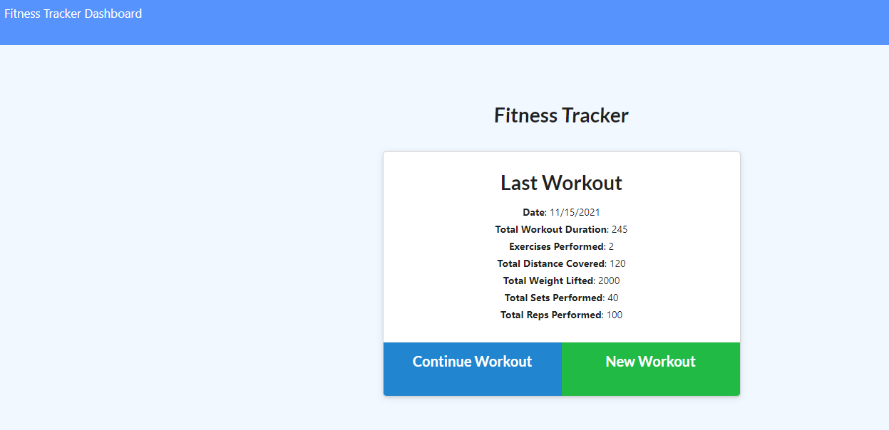
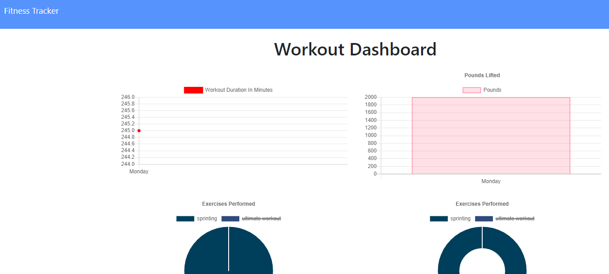
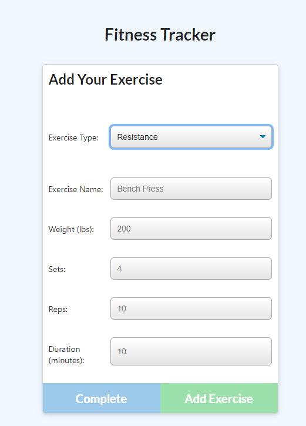

# Fitness Tracker

This is a fitness tracker that allows users to create a workout and add several exercises to that workout. Users can choose from two types of exercises (resistance or cardio) and add as many exercises as they want to their workout. Users can also see stats of their past 7 workouts on the dashboard presented in graph form.

## Getting Started

The last workout will automatically be loaded onto the app. You can choose to either continue the workout or make a new workout

## Deployed Link

* [See Site Live!](https://fitness-tracker-emdorgan.herokuapp.com/)

## Screenshot

## Built With

* [Javascript](https://developer.mozilla.org/en-US/docs/Web/JavaScript)
* [Node.js](https://nodejs.org/)
* [MongoDB](https://www.mongodb.com/)
* [Mongoose](https://mongoosejs.com/)

## Authors

**Emily Dorgan** 

- [Link to Portfolio Site](https://emdorgan.github.io/updated-portfolio/)
- [Link to Github](https://github.com/emdorgan)
- [Link to LinkedIn](https://www.linkedin.com/in/emily-dorgan/)

## License

This project is licensed under the [MIT License](https://opensource.org/licenses/MIT)